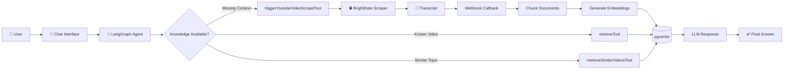

<div align="center">

# 🧠 Document-Retrieval

### An Agentic RAG System That Fetches Its Own Missing Knowledge

Instead of failing when information is missing, this system decides **how to acquire it**. It searches existing knowledge, discovers similar content, or scrapes and indexes new YouTube transcripts before answering.

**The goal isn't just retrieval—it's acquisition.**


</div>

---

# 💡 Why This Project?

Traditional Retrieval-Augmented Generation (RAG) systems work well only when the required documents already exist inside the vector database.

But what happens when the answer isn't there?

Most systems either:

- Hallucinate
- Return "No relevant documents found"

This project explores a different approach.

Instead of treating missing context as failure, the agent treats it as **another problem to solve.**

If knowledge doesn't exist yet, it automatically:

- finds the appropriate source
- retrieves the transcript
- chunks and embeds it
- stores it inside the vector database
- continues answering the user

The chatbot behaves less like a search engine and more like a research assistant capable of expanding its own knowledge base.

---

# ✨ Features

- 🤖 Agentic Retrieval using LangGraph
- 🔍 Semantic Search with pgvector
- 📺 Automatic YouTube Transcript Retrieval
- 🌐 BrightData Scraping Integration
- ⚡ Async Webhook Pipeline
- 🧠 Retrieval-Augmented Generation (RAG)
- 📚 Dynamic Knowledge Acquisition
- 🔄 Stateful Agent Memory
- 🚀 Vector Similarity Search
- 💬 Conversational Research Workflow

---

# 🎥 Demo

> **Replace these with your own assets**

<div align="center">

### How the Loop Works


---


</div>

---

# 🏗️ Architecture



---

# ⚙️ Workflow

1. User submits a question.
2. LangGraph agent determines which retrieval strategy is appropriate.
3. Existing transcript is searched if available.
4. If unavailable, similar videos are searched.
5. If nothing relevant exists, BrightData scrapes the transcript.
6. Transcript is chunked and embedded.
7. Embeddings are stored inside pgvector.
8. Agent retrieves updated context.
9. Final response is generated.

---

# 🧰 Agent Tools

| Tool | Purpose |
|------|---------|
| retrieveTool | Search transcript of a known video |
| retrieveSimilarVideosTool | Semantic search across indexed videos |
| triggerYoutubeVideoScrapeTool | Scrape and index new transcripts |

```ts
const tools = [
    retrieveTool,
    retrieveSimilarVideosTool,
    triggerYoutubeVideoScrapeTool,
];

const agent = createReactAgent({
    llm: claude,
    tools,
    checkpointer: new MemorySaver(),
});
```

---

# 🛠️ Tech Stack

| Layer | Technology |
|------|-------------|
| Frontend | React + TypeScript + Vite |
| Backend | Node.js |
| Agent Framework | LangGraph |
| LLM | Claude |
| Scraping | BrightData |
| Embeddings | LangChain |
| Vector Database | PostgreSQL + pgvector |
| Async Communication | Webhooks |

---

# 📂 Project Structure

```
Document-Retrieval
│
├── client
│   ├── public
│   ├── src
│   └── package.json
│
├── server
│   ├── agents
│   ├── tools
│   ├── routes
│   ├── webhook
│   └── vectorstore
│
├── assets
│   ├── demo.gif
│   └── architecture.png
│
└── README.md
```

---

# 🚀 Getting Started

## Clone Repository

```bash
git clone https://github.com/riyav1606/Document-Retrieval.git

cd Document-Retrieval
```

---

## Install Dependencies

Frontend

```bash
cd client

npm install
```

Backend

```bash
cd server

npm install
```

---

## Environment Variables

Create a `.env` inside the **server** directory.

```env
ANTHROPIC_API_KEY=your_api_key

BRIGHTDATA_API_KEY=your_api_key

DATABASE_URL=your_postgresql_connection

WEBHOOK_URL=your_webhook_url
```

> Never commit real API keys.

---

## Run

Backend

```bash
cd server

npm run dev
```

Frontend

```bash
cd client

npm run dev
```

---

# 📈 Future Improvements

- Multi-platform document ingestion
- Background job queues
- Streaming responses
- Authentication
- Docker deployment
- Kubernetes support
- Better reranking pipeline
- Multi-agent collaboration

---

# 🎯 What This Project Demonstrates

- Building stateful AI agents using LangGraph
- Practical Retrieval-Augmented Generation
- Async webhook architecture
- Vector search with pgvector
- Semantic retrieval
- Agent tool orchestration
- Dynamic knowledge acquisition
- Production-style AI pipeline design

---

# 👩‍💻 Author

**Riya Vairale**

GitHub: https://github.com/riyav1606

---

<div align="center">

### ⭐ If you found this project interesting, consider giving it a star!

Built to explore what AI systems look like when they can **acquire knowledge instead of merely retrieving it.**

</div>